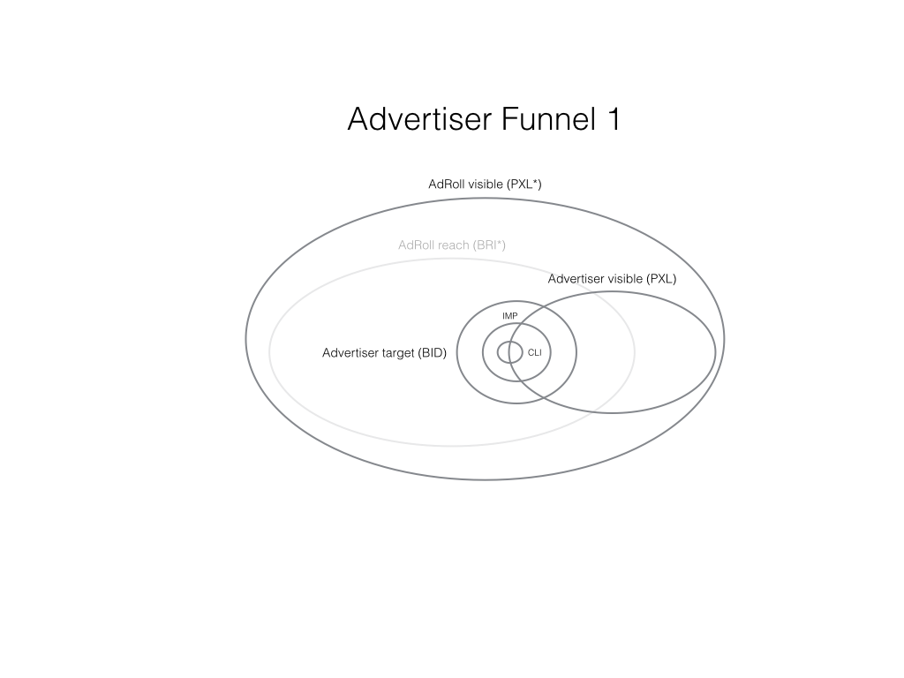
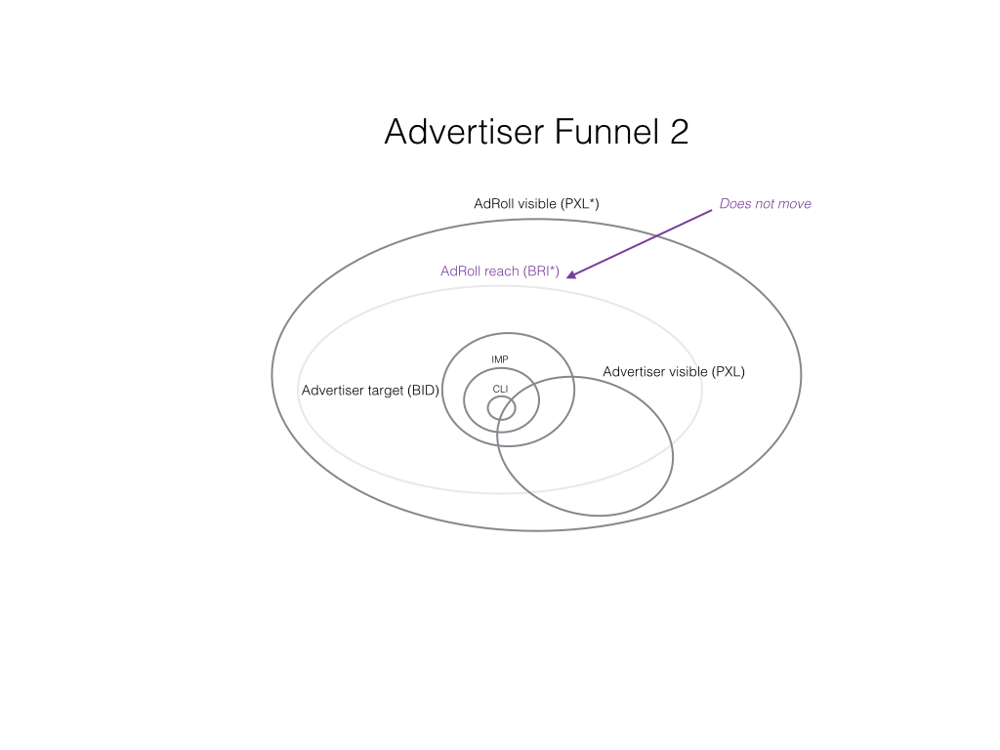
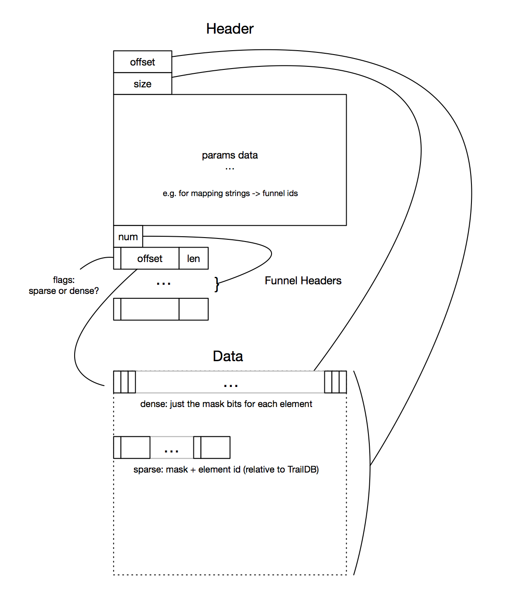

# FUNNELDB

## What's a funnel?

Imagine you are in AdRoll user space, and you are trying to figure out how many unique users are in various stages of the AdRoll pipeline.
Now imagine there are two advertisables, `Advertiser 1` and `Advertiser 2`.

Advertiser 1 has pixel events for some subset of ALL the AdRoll pixel events.
The cookies Advertiser 1 sees are a subset of all the cookies AdRoll sees.
Similarly, the cookies Advertiser 1 bids on are a subset of ALL the cookies AdRoll bids on.
Furthermore, the cookies AdRoll bids on are a subset of the cookies AdRoll gets bid requests for.
The impressions Advertiser 1 serves are not only a subset of AdRoll impressions, but a subset of the users Advertiser 1 bid on (theoretically).
The users that click on Advertiser 1 impressions are not only a subset of AdRoll clicks, but a subset of the users Advertiser 1 served an impression to.
And so on and so forth.

Instead of a thousand words, consider the picture below:



Similarly, Advertiser 2 has a whole other series of sets and subsets associated with their user activity.
Suppose it looks something like this:



For the purposes of FunnelDB, When we talk about funnels, you should picture a situation something like this.

## Analyzing Funnels

Notice that each funnel has an interesting property.
The 'top' of each funnel is the superset of all elements appearing in later steps.
Generally speaking, lower steps in a funnel are subsets of higher ones.
Even parallel steps which are at the same level in a funnel, may contain highly overlapping sets.
This is the primary insight that drives the design of FunnelDB.

If we have a funnel with 8 steps, there are `2**8 = 256` possible combinations of steps.
Instead of storing 256 independent sets though, we can store one superset containing all the elements,
and 8 bits indicating whether or not each element participates in each step.
If there are 1000 total elements in our superset, we can store 1000 bytes for the total set, plus the cost `E` of storing the element itself.
If we had stored the sets separately, we could have stored the sets using `256 * E * N`, where `N` is the average set size.

Let `F` be the number of steps in our funnel and `S` is the cardinality of the superset.
The question comes down to when is:

```
S * (F + E) <  2**F * N * E
```

The answer is quite often, when the sets are overlapping.
When the combination sets are completely disjoint, `S = N * 2**F`, and we pay an extra `F` bits per funnel for storing them this way.
FunnelDB is optimal for storing sets where `S << N * 2**F`.
That is, the subsets are overlapping.

## FunnelDB Layout

This is what a FunnelDB looks like internally:



## FunnelDB + TrailDB

FunnelDBs are relative to TrailDBs.
Instead of using 16-bytes per cookie, a FunnelDB uses an identifier relative to the cookie space of a given TrailDB.
Currently, this is defined at compile time to be a 32-bit identifier.

FunnelDB is very powerful, but relatively low-level by itself.
You create a FunnelDB by supplying a probe function, which gets called for every event in a TrailDB.
If you want to add a cookie to a funnel from the probe function, you can emit it to a funnel using it's funnel id.
Internally, funnels only have integer IDs, since they can be any anything.
Working with funnels this way would be quite a burden on the user, so another level of abstraction is provided on top of the raw funnels.

The most common use case for funnels have to do with picking a field, or combination of fields, from a TrailDB,
and creating one funnel per value of the field, or combination thereof.
There is also generally a field which identifies the step within the funnel (a.k.a. the `mask`).
For AdRoll data this is generally the event `type` field.
FunnelDB provides an easy constructor for exactly this case.
Instead of supplying the probe function, you tell the easy constructor which fields, or combinations, you want to create funnels for.
The easy constructor uses the `params` data to store the mapping, so that consumers of the data can know how the DB was constructed from the TrailDB.
Since this is by far the most common and useful way to use FunnelDB, the FunnelDB command-line tool relies on this particular mapping of TrailDB fields to FunnelDB funnels.
